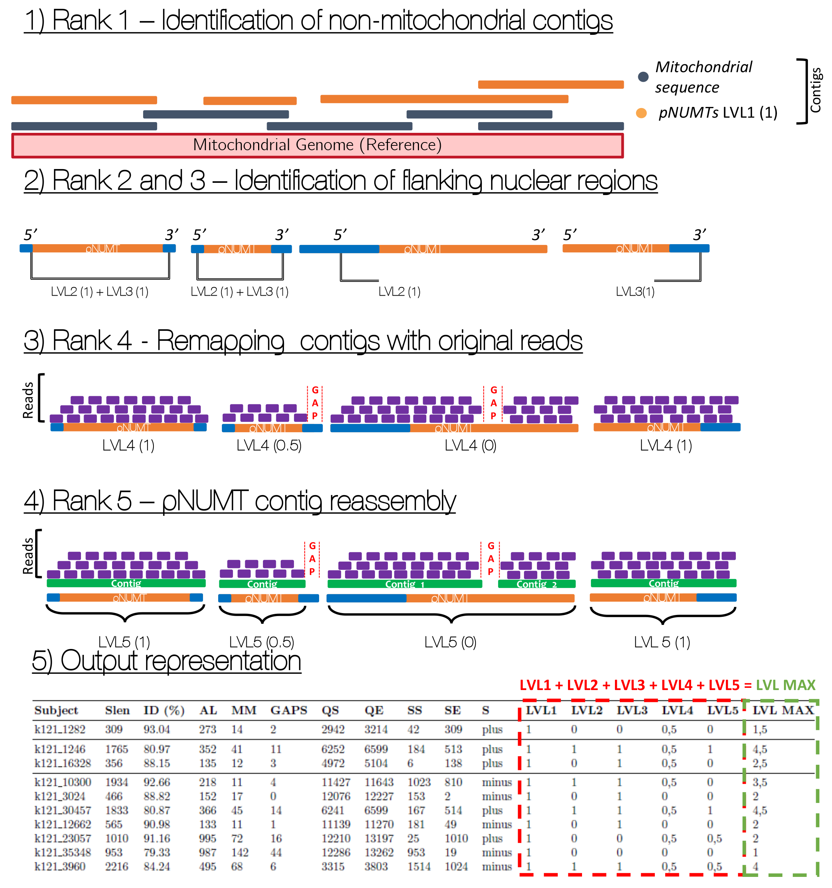

# ALLMT - NUMT Searching Tool


## About ALLMT
___

This repository contains all the needed dependecies to run the ALLMT. ALLMT is pipeline that uses BLASTN to search NUMTs (_pronounce NewMight_), which are mitochondrial sequences inserted inside the nuclear genome. ALLMT relies on the search of contigs/scaffolds generated by NGS assembly (at this moment this tool only process .fasta from SPADES or MEGAHIT) classifying the contigs using a five level rank system to define a NUMT.

This pipeline was developed by Carlos Henrique Aguiar Costa (carloscostaha@gmail.com)

## Strategy of ALLMT

The _five ranks based system_ acts through the comparision of the aspects of that define a NUMT (e.g: not identical to mitochondrial genome, flanking regions from nuclear origin), as it is a inserted sequence in the nuclear genome, the NUMT is under different evolutionary rates from the mitochondria, meaning that it may shows certain mutations. Besides, our tool is designed to compare *contigs/scaffolds*, from NGS assembly, to reference genomes -- which we strongly suggest using the closest species possible -- and distinguishing based on identity values from BLASTN, flanking nuclear regions in 5' and 3', and using NGS original reads to search for gaps and reassembling as the original contig. In the end, it generates an updated 'outfmt '6' table from BLASTN, consisting of all ranks (LVLs), and a final level (LVL_MAX), consisting as the sum of all other levels, with value ranging from 1-5.

* **Rank 1** - Comparision between the reference mitochondrial genome with the contigs, based in BLASTN identity (0-1) 
* **Rank 2** - Search for flank region in 5' (+), at least 100bp long before the hit (0-1)
* **Rank 3** - Search for flank region in 3' (-), at least 100bp long after the hit (0-1)
* **Rank 4** - Contig remapping with original reads, using Bowtie2 and Samtools, and search for gaps inside/outside the hit region (0 - gap inside; 0.5 - gap outside; 1 - No gaps found)
* **Rank 5** - Reassembly of contigs using the remapped reads


___

## Dependencies 

The dependecies must be installed in PATH variable of the system. Meeting the specific versions as described below

* blast (2.11.0)
* SPAdes (v3.14.1)
* megahit (v1.2.9)
* bowtie2 (2.3.4.1)
* samtools (1.7)
* bedtools (v2.26.0)
* SEQtk (1.2-r94)
* Python (3.6.9) Dependencies
  * typing_extensions (3.10.0.2)
  * numpy (1.19.5)
  * pandas (1.1.4)
  * whichcraft (0.6.1)

### Installing Dependecies

At this moment, the easiest way to install all the Python dependencies required to run ALLMT is to create a *conda enviroment*, using CONDA.

```
  conda env create -f env/ALLMT.yaml
  conda activate ALLMT
```

## Installation

The installation of ALLMT can be done by cloning the repo inside the destination folder

```
  git clone https://github.com/carloshacosta/ALLMT
  cd /ALLMT
  chmod +x all_mt.py
```

## Usage

The basic usage of ALLMT requires at least four files as input:
* 1 Reference Mitochondrial Genome `--m` (.fasta)
* 1 Contig file from MEGAHIT/SPades assembly only `-assembler`(.fasta)
* 2 Paired-end reads file `-R1` and `-R2` (.fastq)
  * Note: ALLMT also support more 2 unpaired read files, forward and reverse
  * Note 2: `--db` also allows user to declare the (.fasta) containing all the reads in fasta format, if it's not, ALLMT will create inside `-o <output_dir>` database. 
  * *ps: Note that if you rewrite the folder `--db` will also be deleted*

```  
python3 all_mt.py --m <genome.fasta> -contigs <contigs.fasta> -assembler megahit -R1 <paired1.fastq> -R2 <paired2.fastq> -db <database> -o <output_dir>
```
### Optional 

* Identity Threshold: Users can also change the BLASTN identity threshold by setting the `-id` function to a float value (Default: 95)
    * Note that if the set value doesn't match any contig hit, ALL_MT will print a message in the screen
* Flanking Threshold: User can also change the integer value for flank call in both 3' and 5' of sequence strand, by setting `-f` function (Default: 100)
    
